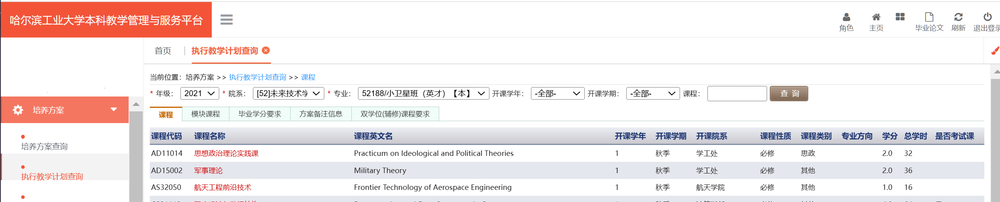

# 什么是培养方案，怎样查阅培养方案？

## 培养方案的意义

培养方案里包含该学期的所有课程、学分数、是否考试课。由于培养方案自2016以来一年一改，所以往届培养方案可能会有较大区别，但是整体上仍然具有参考价值，大家可以根据相关的课程提前进行复习、咨询学长相关的选课经验。

## 查阅培养方案

我们通常在[jwts](http://jwts.hit.edu.cn)上查阅执行教学计划而不是直接查看培养方案，因为培养方案文档更新很慢，执行教学计划才是最新的培养方案。
打开网站之后，可以先在最上方右侧中将配色改为“黄色”（虽然我看着是橙色），以便后续我们的ui界面统一

在这个界面的左侧，点击执行教学计划查询，就可以看到要查看的培养方案。

这里值得注意的是，由于分流的存在，专业内会列出特别多的培养方案。我在这里列出几个常用的培养方案供大家参考：

- 21级未来技术计算机:2021-52未来技术学院-52WL031（注意要有WL）
- 21级未来技术人工智能:2021-52未来技术学院-52WL036（注意要有WL）
- 21级计算机：2021-13B计算学部-13B031
- 21级人工智能：2021-13B计算学部-13B036

- 22级未来技术人工智能模块:2022-52未来技术学院-52WL02/人工智能领域方向(2+X模式)
- 22级计算机：2022-13B计算学部-13B031
- 22级人工智能：2022-13B计算学部-13B036

- 2023级未来技术:2023-52未来技术学院-52WL01/未来技术模块
- 2023级计算机：2023-13B计算学部-13B23L030/计算机与电子通讯类

注意，上述都是2024年6月的查询结果，未来技术在大一分领域，大二分专业，所以查询的专业代码要发生相应的变化，例如2025年查2023级培养方案就不再查询未来技术模块，而是查询人工智能领域，到了2026年查2023级培养方案就要查询人工智能专业，其他同理。
**如果各位实在不清楚要查哪个培养方案，可以把想查的全都试一遍，看看包含是最新的课程。**