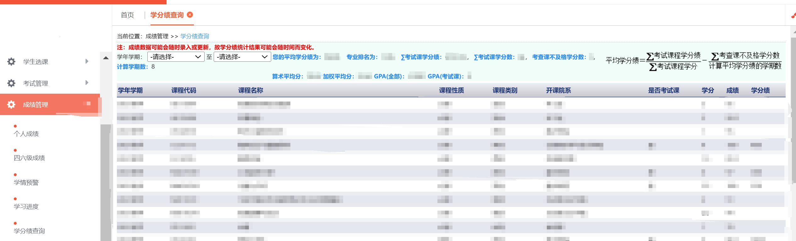

# 学分绩的计算方法

哈工大的正式学分绩是百分制考试课加权平均分，具体计算公式为：

此外，教务系统上也显示所有课程的算数平均分、加权平均分、全部课程GPA、考试课GPA用于给出国的同学们提供各种排名证明。

哈工大的GPA目前是按照4.0制，90+记为满分来计算的。具体的计算方法暂时没有公布。

由于考试课和考察课的制度，只能通过水选修课提升*GPA(全部)*不能提升*GPA(考试课)*
