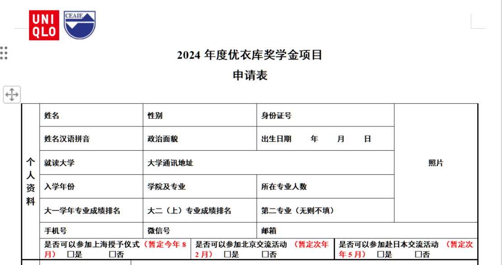

# 函评的注意事项

函评，顾名思义，指的是纯粹依据文字材料，没有面试地进行筛选。这种考核方法常见于特殊奖学金的评选中。一般来讲，函评的主要格式是一个申请表，包含以下部分:

- 个人基本信息
- 成绩排名
- 英语或其他外语水平
- 曾获奖项和荣誉
- 社会实践经历
- 科研实习经历
以及其他相关内容，接下来我们以[优衣库奖学金的申请表](https://xszz.hit.edu.cn/2024/0407/c6391a341586/page.htm)为例讲解函评各部分内容的填写方法。

## 个人基本信息

这部分没有太多需要讲解的，有部分奖学金会要求提供排名证明，去教务处开具即可。

