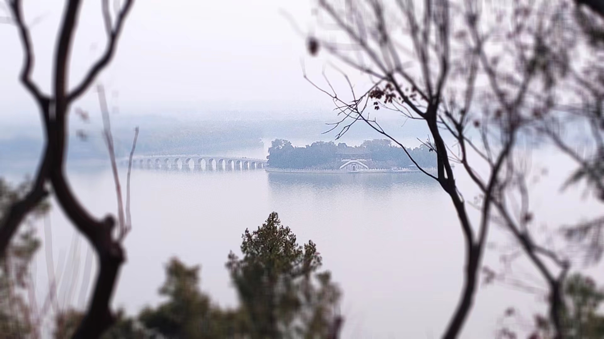

# 跋

不知道看完这些内容读者会作何感想，如果你是一名尚未踏入大学的新生，我衷心地希望你会感觉到前路的精彩与坎坷，了解了新的东西，有了新的思考，对自己要做什么有了更清楚的认识，那或许这些东西就没有白写。

在这里，我试图更多的提供经验性的、知识性的、可实践性的内容，而非更励志性的、学术性的内容。有时谈论这些东西——例如功利地科研、学习——像一种亵渎，或许高尚的道路应当是纯粹地体验和欣赏的，但并非人人有这样的闲情逸致。若可能，我愿做泥涂中铺路的人。我愿你抬头看那高缈的蓝天，也愿你垂头时脚下仍有一条坚实的路。

我又一次想起了三年前的故乡，十七孔桥下，金光穿洞，微光粼粼的昆明湖水。三年又三年，未来的路还很长，但愿我们都能走得更远。

## 参考内容&推荐阅读

[上海交通大学生存手册](https://survivesjtu.gitbook.io/survivesjtumanual)
> 国内最流行的新生指南，犹如振聋发聩的呐喊。主要着眼立志、大学生活、出国经验等

[csdiy](https://csdiy.wiki)
> 北大信科学生创建的计算机科学自学手册，经过不断维护内容涵盖方方面面，基本上包含了各个领域优秀的自学资源

[CS-BAOYAN](https://github.com/CS-BAOYAN/)
> 中国最大民间非盈利保研交流群-绿群的github仓库，保研群体的信息整理平台，包含了各个学校的保研信息、历年经验等

[哈工大计信大类2021年新生指南](https://docs.qq.com/doc/DVm9wUVlsQVJ3Qkpo)
> 特别适用于哈工大学生，对于校园生活、入门书籍有比本书更针对性更具体、全面的阐述。其中保研、分流、英才等政策信息由于时效性可能发生了一些变化。

## 致谢

写作本文时，强烈地受到了[上海交通大学生存手册](https://survivesjtu.gitbook.io/survivesjtumanual)启发，也受到了[csdiy](https://csdiy.wiki)的影响。衷心地感谢这些优秀的前辈们，他们的努力让我们少走了许多弯路。

高三的暑假，[哈工大计信大类2021年新生指南](https://docs.qq.com/doc/DVm9wUVlsQVJ3Qkpo)给我带来了强烈的震撼和帮助，其中推荐的《C Primer Plus》被我视为大学一切美好的起点。保研的路上，[CS-BAOYAN](https://github.com/CS-BAOYAN/)提供的信息令我受益匪浅。

感谢哈尔滨工业大学未来技术学院、计算学部和航天学院的老师同学们。大学的生活如同象牙塔一般美好，这是最美的日子。
